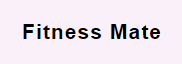
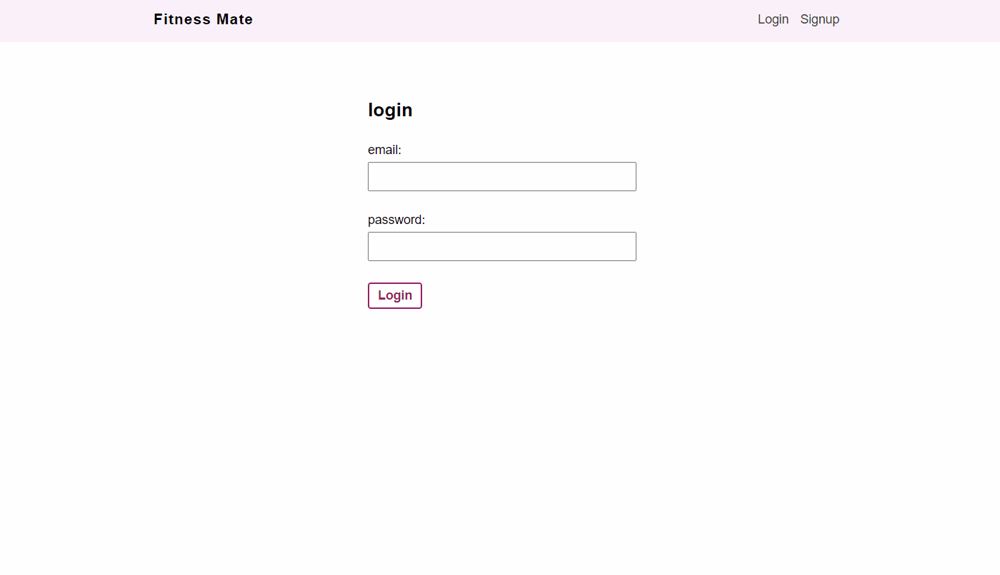

<h1 align="center">
   
  
</h1>

<h4 align="center">A fitness tracker that lists all your exercises</h4>

## Features

* React.js frontend
* Firebase authentication
* Firebase backend 
* Hosted via firebase
* add / delete exercises